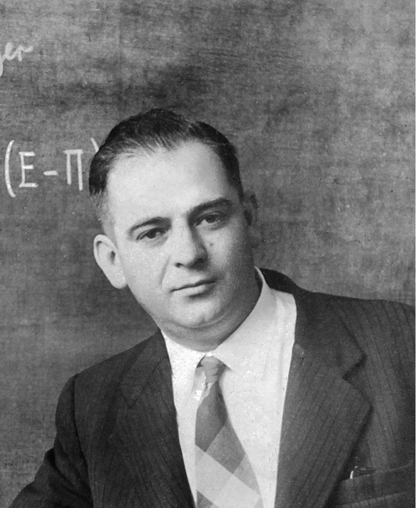
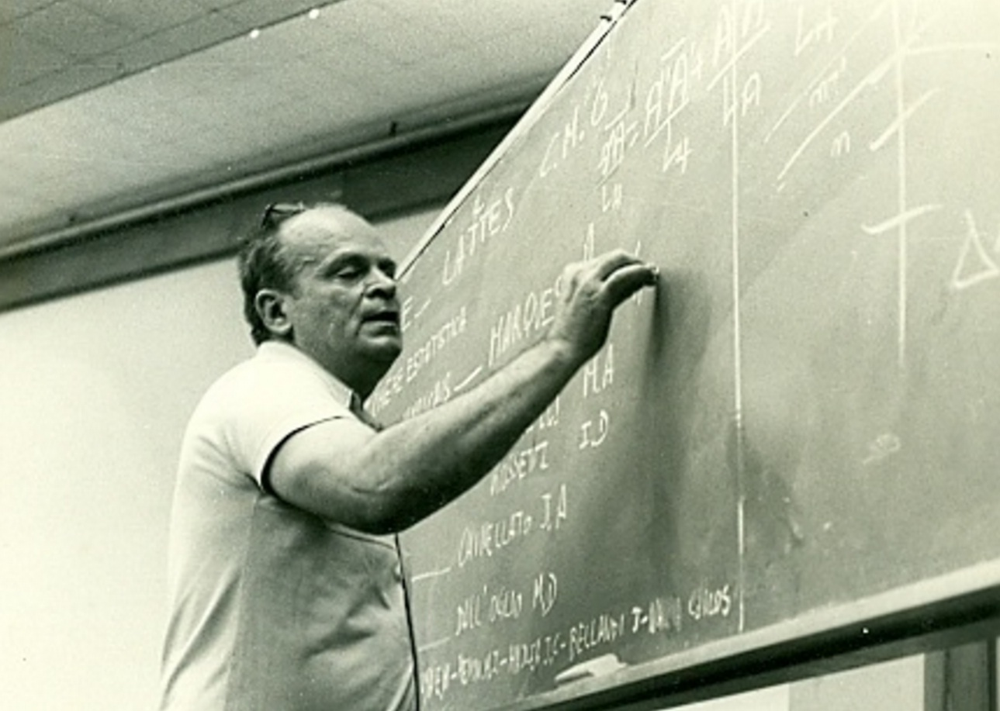

<!-- _class: lead -->

# Físico Teórico

#### Introdução à profissão

**Aluno: Reinan Gabriel Dos Santos Souza**
Bacharelado em Sistemas de Informação
Instituto Federal de Sergipe
Campus Lagarto

<!-- _footer: '02 de outubro de 2023' -->

---

<!--  -->

**Arquivos para a apresentação**

Todos os materiais relacionados à apresentação do seminário sobre física teórica estão disponíveis digitalmente no meu repositório do **GitHub**. Para acessar esses recursos, basta escanear o **QR Code** na imagem ao lado.

> Github: https://github.com/reinanhs/clfi-fisico-teorico

---

<!-- _header: Sumário -->

- Introdução
- O que um físico faz?
- O que faz um físico teórico?
- Como me torno um físico teórico?
- Situação da profissão de Físico Teórico no Brasil
- Desafios adicionais no contexto Brasileiro
- Mercado de trabalho
- Salários médios de físicos teóricos no Brasil
- Conclusão

---

<!-- _header: Introdução -->

Este apresentação tem como objetivo lançar luz sobre a jornada de como se tornar um **físico teórico** e descrever as atividades envolvidas nessa carreira intrincada e repleta de desafios.

- Os físicos teóricos dedicam suas vidas à exploração das **fronteiras do conhecimento**.
- Ajudam na compreensão das **partículas subatômicas** até as **leis que governam o universo**.
- Contribuição para o avanço e surgimento de novas tecnologias.

---

<!-- _header: Introdução -->

Ao concluir a **graduação em física**, os estudantes têm a oportunidade de escolher entre duas trajetórias distintas:

- O caminho do **licenciado em física**: Voltado para o ensino nas escolas de ensino médio e pesquisa educacional.
- O caminho do **bacharel em física**: Encaminha para uma carreira promissora na pesquisa e no ensino universitário.

> Este último cenário é marcado por uma constante inovação tecnológica que desafia as barreiras do conhecimento e impulsiona o desenvolvimento de novas tecnologias e dispositivos.

---

<!-- _header: Introdução -->

Este estudo abordará em detalhes como se tornar um físico teórico, destacando a necessidade de uma formação:

- Formação sólida em física.
- Cursos de mestrado e doutorado em física teórica.

---

<!-- _header: Introdução -->

Além disso, exploraremos as atividades cruciais desempenhadas por físicos teóricos:

- Pesquisa.
- Experimentação.
- Análise de dados.
- Publicação e ensino.

---

<!-- _header: O que um físico faz? -->

A missão dos físicos consiste em desenvolver componentes capazes de aprimorar tecnologias já existentes e conceber ferramentas que impulsionem a criação de novos dispositivos.

A conclusão da graduação em física abre portas para a obtenção dos títulos de **bacharel** ou **licenciado** em física.

- O licenciado em física possui a habilidade de lecionar em escolas de ensino médio.
- O bacharel em física embarca em uma jornada promissora voltada para a pesquisa e o ensino universitário.

---

<!-- _header: O que um físico faz? -->

O professor universitário de física geralmente tem uma carga horária definida para as **aulas** e liberdade para criar e participar de **grupos de pesquisa** em diferentes temas.

- O físico que se dedica à pesquisa teórica trabalha em uma universidade ou laboratório científico.
- Suas atividades principais incluem realizar **pesquisas**, fazer **experimentos**, **analisar dados**, **publicar resultados** e **ensinar** os alunos.
- Desempenham um papel essencial na pesquisa científica e contribuem de maneira significativa para o avanço do conhecimento no campo da física.

---

<!-- _header: O que faz um físico teórico? -->

- Ele é um profissional que se dedica a estudar os fenômenos naturais em seus níveis mais básicos.
- Ele busca entender as leis que governam o universo usando a matemática como ferramenta.
- Ele desenvolve teorias e modelos matemáticos que tentam explicar e prever o comportamento da matéria e da energia.

O trabalho do físico teórico envolve diversas atividades, que podem variar de acordo com o seu local de atuação e a sua área de especialização.

---

<!-- _header: Fisica teórica vs Fisica aplicada -->

<video width="100%" height="100%" controls>
  <source src="./videos/fisica-teorica-e-fisica-aplicada.mp4" type="video/mp4">
  Your browser does not support the video tag.
</video>

> Sérgio Sacani: https://youtu.be/QyVEFTfbP0s

---

<!-- _header: Pesquisa -->

A pesquisa é uma das principais atividades do físico teórico. Ele investiga e formula teorias sobre vários assuntos relacionados à física. Por exemplo:

- Teorias sobre buracos negros.
- Teorias sobre mecânica quântica.
- Teorias das cordas.

Na pesquisa são feitas hipóteses baseadas na sua área de especialidade. 

---

<!-- _header: Abrahão de Moraes -->

Abrahão de Moraes, atuou incansavelmente pelo desenvolvimento da Astronomia e das Ciências Espaciais no Brasil.

Participou do primeiro grupo de pesquisa em Física Teórica criado na USP. Seus primeiros trabalhos foram publicados pela Academia Brasileira de Ciências.

> Fonte: https://www.sbfisica.org.br

---

<!-- _header: Experimento -->

O experimento é outra atividade importante do físico teórico. Ele testa e valida as suas teorias por meio de equações **matemáticas** complexas ou observações no nível **micro** ou **macro**.

**Por exemplo**: Ele pode observar como uma força atua na Terra para compreender como ela atua no espaço.

Para ser eficiente nisso, ele precisa ter habilidade para aplicar as leis **matemáticas** em diferentes escalas.

---

<!-- _header: Análise de dados -->

A análise de dados é uma atividade essencial do físico teórico. Ele interpreta os dados que obtém por meio das suas pesquisas e experimentos.

A análise de dados é importante para que as suas descobertas sejam aplicáveis na prática e aceitas pela comunidade científica.

---

<!-- _header: Publicação de descobertas -->

A publicação de descobertas é uma atividade relevante do físico teórico. Ele divulga as suas teorias e resultados em **revistas científicas** ou outras **publicações**.

Isso é fundamental para que ele contribua para o avanço do conhecimento em física e receba o reconhecimento pelo seu trabalho.

---

<!-- _header: Ensino -->

O ensino é uma atividade comum do físico teórico. Ele geralmente dá aulas em universidades ou institutos de pesquisa. 

Ele explica as suas teorias e como chegou às suas descobertas para os alunos. 

Em algumas escolas, ele também orienta os alunos em laboratórios, onde eles realizam experimentos e testam as suas teorias.

---

<!-- _header: Exemplo -->

César Lattes, o brasileiro cuja descoberta foi premiada com Nobel.

Físico brasileiro, sete vezes indicado ao prêmio, estava na equipe que o recebeu em 1950.

> Fonte: http://www.jornaldocampus.usp.br/index.php/2019/10/cesar-lattes-o-brasileiro-cuja-descoberta-foi-premiada-com-o-nobel/

---

<!-- _header: Exemplo -->

- César Lattes formou-se em Física e Matemática pela USP, na turma de 1943.
- Quatro anos depois, em 1947, seria o responsável pela descoberta da partícula subatômica.

Essa descoberta que levou à concessão do **Prêmio Nobel de Física** de 1950.

> Fonte: http://www.jornaldocampus.usp.br/index.php/2019/10/cesar-lattes-o-brasileiro-cuja-descoberta-foi-premiada-com-o-nobel/

---

<!-- _header: Exemplo -->

---

<!-- _header: Citação -->

Eu acho interessante destacar uma citação do site spiegato que resume bem o papel do físico teórico na ciência:

"*Os físicos teóricos são cientistas que se concentram na compreensão dos princípios fundamentais da natureza, desenvolvendo teorias e modelos matemáticos para explicar fenômenos físicos.*" (SPIEGATO, 2021, p. 1)

> SPIEGATO: https://spiegato.com/pt/o-que-faz-um-fisico-teorico

---

<!-- _header: Como me torno um físico teórico? -->

- O primeiro passo é uma sólida formação em física.
- Dedique-se ao estudo de **matemática avançada**, **mecânica quântica**, **relatividade** e outras **áreas-chave**.
- Continue para um curso de **mestrado** e depois para um **doutorado** em física teórica.
- Participe de projetos de pesquisa sob a supervisão de professores qualificados.
- Você também deve compartilhar seu conhecimento dando aulas ou workshops em universidades.

> Segundo informações do site spiegato "*Tornar-se um físico teórico geralmente requer um doutorado em física ou matemática, experiência de pós-doutorado e vários anos de experiência profissional aplicando física*".

---

<!-- _header: Situação da profissão de Físico Teórico no Brasil -->

Os físicos teóricos no Brasil se especializam em diversas áreas, como física de partículas, astrofísica, cosmologia, física da matéria condensada e muitas outras.

As escolhas de especialização muitas vezes estão relacionadas com as prioridades de pesquisa e as oportunidades oferecidas por instituições brasileiras.

---

<!-- _header: Situação da profissão de Físico Teórico no Brasil -->

Muitos físicos teóricos brasileiros fazem pós-graduação no exterior, em universidades e instituições de pesquisa de prestígio. 

No entanto, o Brasil também tem programas de pós-graduação de excelência em física teórica, em universidades como: 

- Universidade de São Paulo (USP), 
- Universidade Estadual de Campinas (UNICAMP).

---

<!-- _header: Desafios adicionais no contexto Brasileiro -->

- A pesquisa científica no Brasil pode enfrentar limitações de **financiamento**, o que pode comprometer a capacidade de realizar pesquisas de longa duração e projetos inovadores.
- Outro aspecto desafiador é que a **infraestrutura** em alguns casos pode ser insuficiente para atender todas as demandas de pesquisa.
- Mudanças nas **políticas públicas** relacionadas à ciência e tecnologia podem afetar o ambiente de pesquisa no país.

---

<!-- _header: Mercado de trabalho -->

Físicos teóricos encontram oportunidades de emprego em diversos setores, incluindo:

- Universidades.
- Instituições de pesquisa.
- Empresas de tecnologia.
- Órgãos governamentais.

Suas funções podem abranger áreas de **ensino**, **pesquisa** e **consultoria**.

---

<!-- _header: Salários médios de físicos teóricos no Brasil -->

Os salários variam de acordo com o nível de formação, experiência profissional, instituição empregadora e campo de atuação. 

- Um professor universitário com doutorado em física pode receber salários que variam entre **R$ 5 mil** e **R$ 15 mil** por mês, 
- Um pesquisador em uma empresa privada pode ganhar entre **R$ 8 mil** e **R$ 20 mil** por mês.

---

<!-- _header: Conclusão -->

Concluímos que os **físicos teóricos**, tanto no Brasil quanto em todo o mundo. 

- Eles são os arquitetos do conhecimento
- Os exploradores das fronteiras do entendimento humano
- Os educadores que inspiram as futuras gerações a continuar essa busca incessante por respostas.